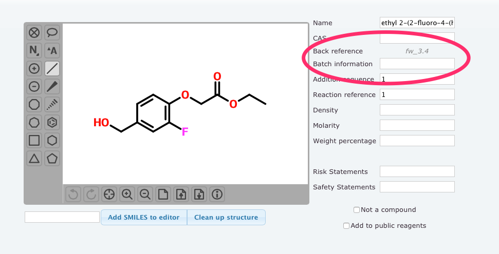
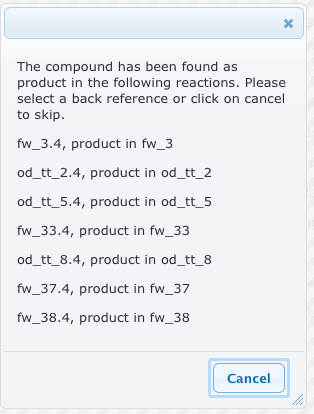
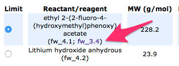

# Back referencing

Reactants and reagents can be back referenced to a product already in the groups labbooks. This greatly simplifies the traceability of a reaction. In addition, batch information can be added, such as "crystallization number 2" or "SigmaAldrich, product number S576050, lot No 353425".

The functionality is exposed while adding or editing reactants and reagents, where the two lines "Back reference" and "Batch information" can be seen (see [Figure 1](#fig1)). Clicking the text "Click to set" or the existing back reference will initiate a search among the group's products to find a matching compound. If one or more are found, you will be prompted to select the appropriate one from a list (see [Figure 2](#fig2)). The same search will also be performed when saving a compound if no or an incorrect back reference exists.

*Figure 1: Add/edit panel with the relevant fields circled in red*

*Figure 2: Result list after a back reference search*

The entered information will then be visible in the reaction drawings and tables, with links to follow the back reference (see [Figure 3](#fig3)).

*Figure 3: Reaction table with link to back reference*
