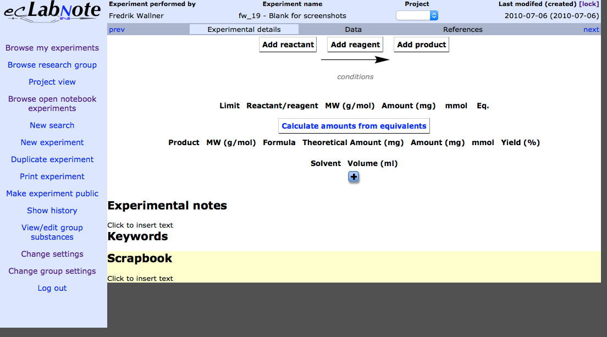
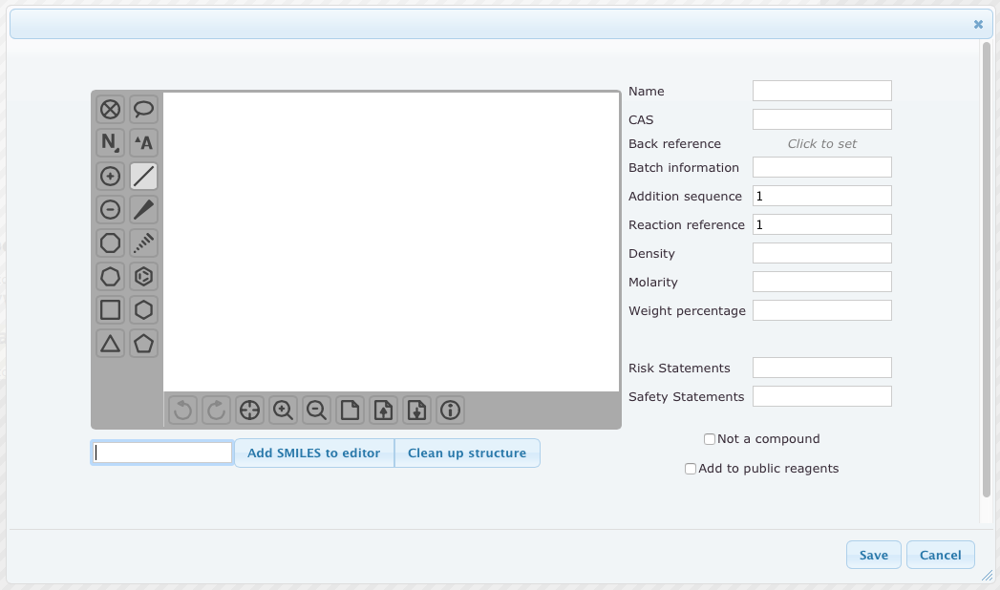
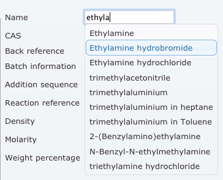
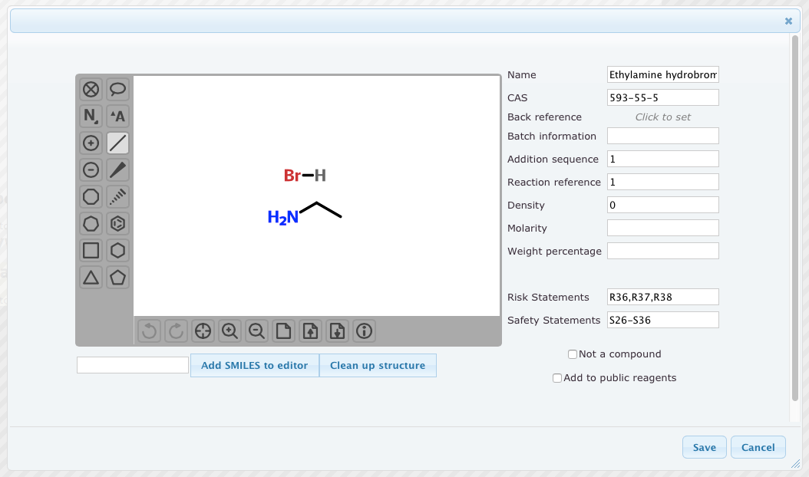
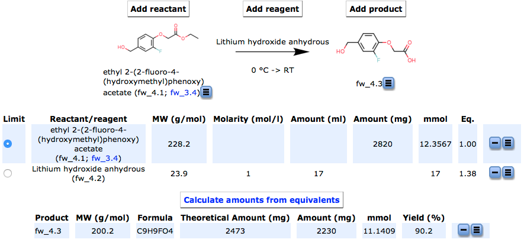
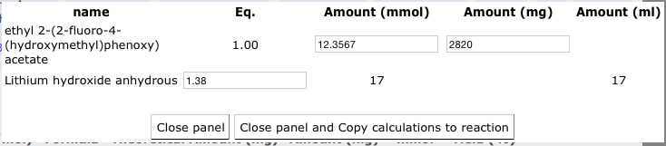
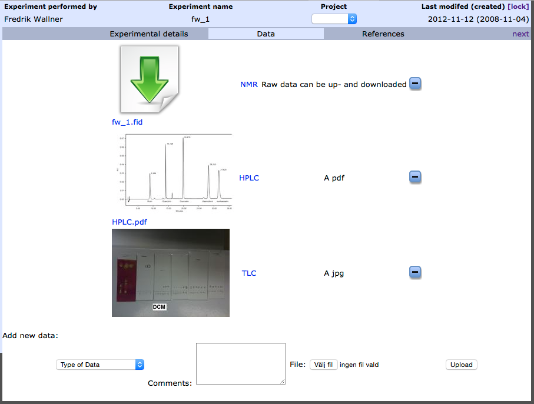
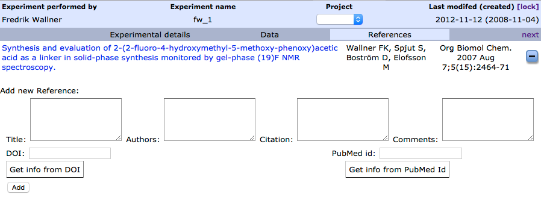

## Screen cast
A screen cast showing the experiment creation can be found at [YouTube](http://youtu.be/5LUcBZPw204)

# Create experiment
To start entering data, you add a new experiment by clicking “New Experiment” in the menu and enter a name for the experiment. The name is meant to be explaining, such as “Alkylation of linker”, and can be changed later on by clicking on it in the experiment header. It is also not mandatory, but can be left blank by just pressing enter.
After adding a new experiment, the view changes to an experiment layout. The menu gets a few more options and to the right the experimental details are shown.


*Figure 1: Empty experimental details*

# Substance addition
The experiment is now ready for input. Reactants, reagents, and products are added via the corresponding buttons on the top of the page. When pressed, these open a panel like in [Figure 2](#fig2). The structure editor to the right has it’s own Help menu, where you can find help and keyboard shortcuts.


*Figure 2: Add substance panel*

## Reagents database
ecLabNote includes a large database of common reagents and users can help to further expand this database by marking the “Add to public reagents” check box.

To take advantage of this database, you can start typing in the “Name”-field. You will then get suggestions on compounds where the name or a synonym matches what you type; see [Figure 3](#fig3). If your wanted compound is among the suggestions, you can stop typing and instead select from the list and structure, density, molarity, and risk and safety statements will be filled in automatically.


*Figure 3: Autosuggestion on compound name*


*Figure 4: Add compound panel after triethylamine auto completion*

## Non-compounds
Normally, ecLabNote will calculate the molecular mass from the chemical structure. However, some reagents and reactants/products don’t have a defined structure, e.g. solid phase resins. To add such a compound, check the box “Not a compound” and the structure editor will disappear and a new field labeled “Loading (mmol/g)” will appear to the right. This field will allow ecLabNote to calculate equivalents and yields also when chemicals without defined structure are used.

In the panel to add substances, there’s also a field called “Addition sequence” which can be used to describe multi-step one-pot reactions or a quenching reagent.

# Amounts table
When substances are added, they will appear in a list in the experimental details (see [Figure 5](#fig5)). For the reactants/reagents, the first column in that list is “Limit”, where you can select which reactant or reagent that is limiting the yield of the reaction. By default it’s the first added substance.


*Figure 5: Top part of the reaction details filled out*

## Calculate amounts from equivalents
When all reactants, reagents, and products are entered, it's time to calculate the amounts to weigh and measure. ecLabNote can help you do this if you click on the "Calculate amounts from equivalents" button, which will bring up the panel in [Figure 6](#fig6).


*Figure 6: Panel to calculate amounts from equivalents*

For the limiting substance, you can enter the amount in one of three ways, in mmol, mg, or ml. For the non-limiting reactants and reagents, you then enter the sought equivalents and ecLabNote will give you the amounts to weigh or measure. The results from this panel can be used in two ways. The first is to take note of the results and close the panel; start weighing and measuring; and then enter the amounts weighed and measured in the reaction details. The other way is to click on “Close panel and Copy calculations to reaction” which will transfer the results of the calculations to the reaction details, and you can then change the amounts to reflect what was weighed and measured. Either way, what is changeable in the list in the reaction details is only the amounts; the rest is calculated automatically.

# Solvents
Solvents are added via the plus button below the solvent list and conversely the minus buttons can be used to remove entries.

# Experiment details
Below the tables are three text fields. The first one is for the experimental procedure and this one is printed together with the lists. The keywords are searchable and allow for experiments to be found by e.g. reaction type or final product. Finally, there is a field called “Scrapbook” where anything can be noted, such as the tare weight of a flask or when a reaction was started. This field is neither printed nor searchable but can be considered as a post-it attached to the reaction page.

# Experimental data
At the top of the reaction details, there are three tabs. So far we have looked at the reaction tab, but there are also tabs for data and references. In the data tab ([Figure 7](#fig7)), any data accompanying the reaction can be uploaded. It can be any kind of document and if it’s an image ecLabNote will show a thumbnail. In addition to the usual types of analytical data, this could also be used to upload an image of the reaction flask to describe the color of the reaction or an experimental setup.


*Figure 7: Data tab*

# References
The references tab ([Figure 8](#fig8)) is meant to keep track of important references for the reaction. The easiest way to enter a reference is by using the DOI that often is printed in the article. In most cases, entering the DOI and clicking on the corresponding button will retrieve the rest of the information and you can just click on “Add” to add it. The DOI is also what allows linking the title to the actual article on the web.


*Figure 8: References tab*
