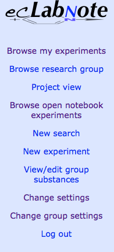
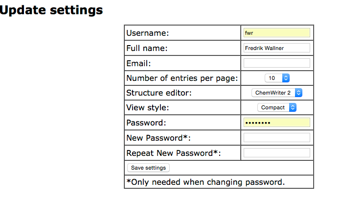
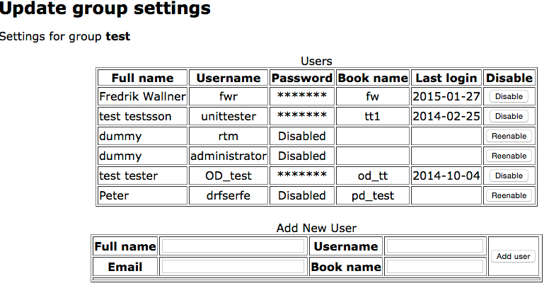

# Login
To login to ecLabNote, you go to [https://www.eclabnote.com/labbook/](https://www.eclabnote.com/labbook/) and select Login. After you enter username and password you will see your latest experiments to the right and the menu (see [Figure 1](#fig1)) to the left.


*Figure 1: Menu at login*

# Settings
In the menu You will also find entries to change settings. “Change Settings” will take you to the panel in [Figure 2](#fig2). Here you can change your username, full name, and password. You can also change your preferred chemical editor and the view style.


*Figure 2: Settings panel*

# Group settings
If you are a group admin, you will find the entry “Change Group Settings” which will allow you to add new users to the group and to disable users.


*Figure 3: Group settings*

To add a new user, enter the full name, username, email, and book name and press “Add user”. The user list will then be updated with a new entry, where the generated password is shown. Please note this password, since it can’t be found after you leave or reload the page. If a user forgets his or her password, you can temporarily disable and then immidiately reenable the account to create a new password. The book name is prefixed to all the users experiments and cannot be changed once the user is created. Common names are user initials or a research group abbreviation combined with the user initials.
