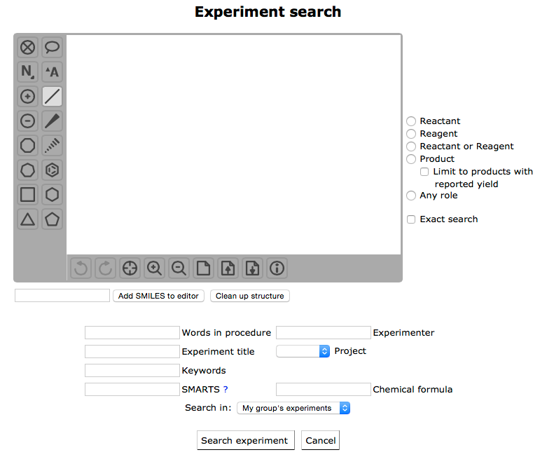

# Reaction search
To search among the reactions you select the “New Search” menu item that will open the page seen below. Here, you can do substructure searches and exact structure searches or search on words in the reaction procedure, the title of the experiment, etc. You can also do more complex substance searches by using the “SMARTS” or “Chemical formula” field. For more information on SMARTS, click on the question mark after the field. You can also specify if you would like so search only your own reactions ore all reactions performed within your research group.


